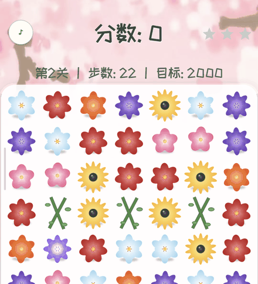
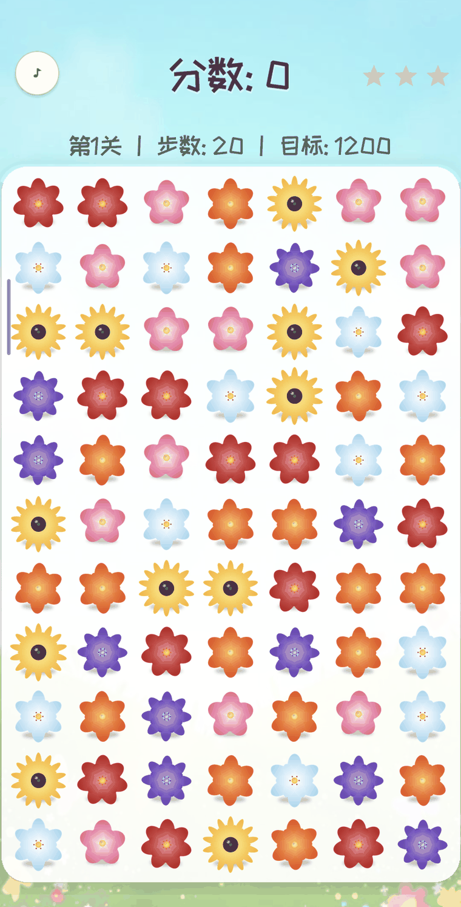
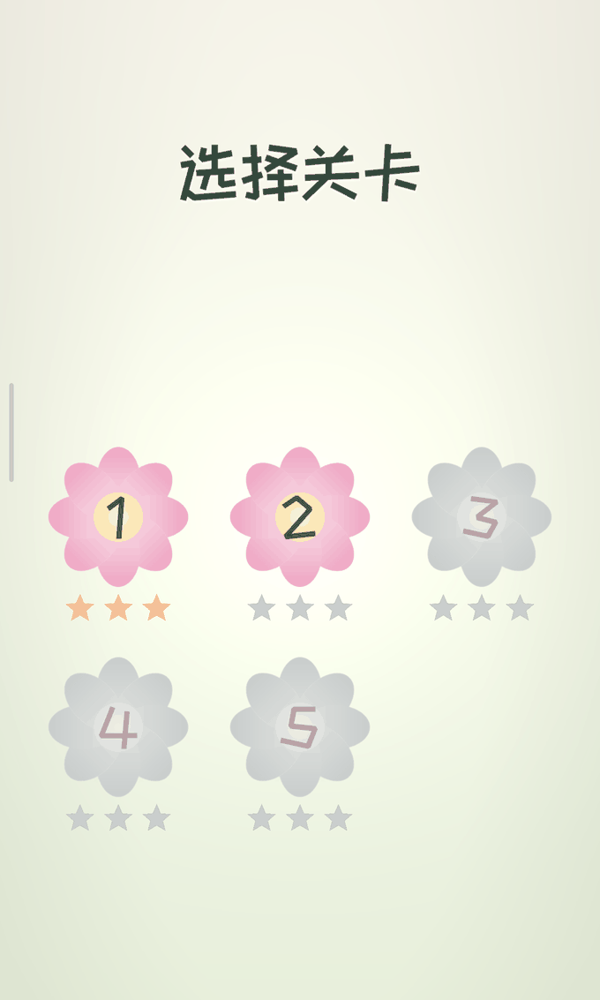
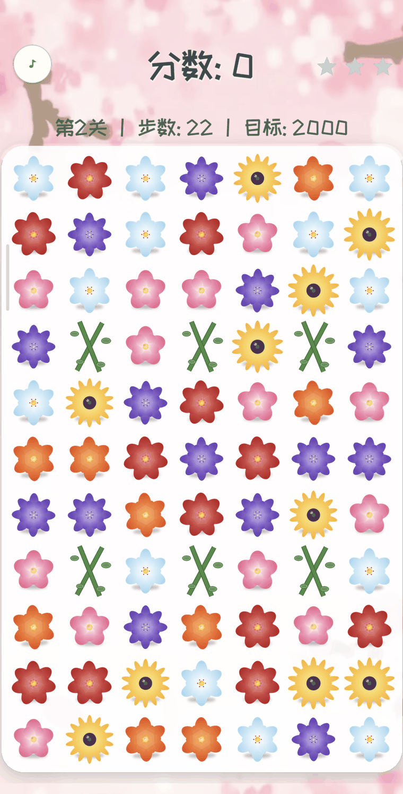

# 鲜花消消乐 · Flower Match 3

[](LICENSE)
[](../../releases)
[](https://godotengine.org)

> 一款用 Godot 4 开发的鲜花主题休闲三消手游（Android）。
> A flower-themed match-3 puzzle game for Android, built with Godot 4.

---

## 🎬 游戏演示

<video src="https://raw.githubusercontent.com/HougeLangley/FlowerMatch3/main/docs/promo.mp4" controls muted width="360"></video>

（若视频无法播放，可[点击此处查看](docs/promo.mp4)。开场宣传片由 MiniMax H3 视频模型基于真实游戏画面生成。）

## 📱 游戏截图

| 花朵闲置动效 | 游戏画面 | 选关界面 |
|---|---|---|
|  |  |  |

| 藤蔓关（樱花主题） |
|---|
|  |

## 🌸 玩法介绍

- **多关卡**：5 个关卡难度递进（目标分 1200 → 6500，步数 20 → 28），过关解锁下一关
- **关卡差异化**：每关都有新鲜感——
  - L1 花园初遇：全开放棋盘（引导关）
  - L2 藤蔓缠绕：**藤蔓障碍**永久占格，布局变化
  - L3 破雪开路：**雪块障碍**相邻消除即破，地图逐步打开（“开图”节奏）
  - L4 心之花园：藤蔓切出心形棋盘 + 中央雪块
  - L5 终极挑战：**5 色棋盘**（少色更易连消，爽快感拉满）+ 双障碍
- **动态背景**：MiniMax H3 生成的竖屏循环视频（晴日花园 / 樱花飘落双主题按关交替），运动柔和、不抢棋盘
- **三星评价**：**玩满步数后按最终得分评星**——达标 1★、1.35× 2★、1.75× 3★；提前打到三星线可完美提前收官；右上角星星随分数实时点亮
- **基本规则**：7×11 棋盘、5~6 种花朵（关卡不同），**点击选中→点击相邻花朵交换**，或**按住花朵轻划到相邻花朵**直接交换；无效交换自动换回（不扣步数）
- **连锁加倍**：消除后花朵坠落补充，连锁消除得分翻倍
- **特殊花朵**：
  - 四连 → **行列消除花**：被消除时引爆整行或整列
  - L / T 形 → **范围爆炸花**：被消除时引爆 3×3 区域
  - 五连 → **魔力花**：与任意花交换可清除全屏同色花朵
  - 特殊花朵之间可以连环引爆
- **体验细节**：消除时花瓣粒子飞散、得分浮字；开局播放可跳过的宣传短片
- **灵动音效**：14 种代码合成音效（消除三音色变体、五声音阶连锁升调、行列/爆炸/魔力花/雪块破碎/点选），多声部池叠加不打断 + 按格子位置左右声场；无效交换有柔提醒，过关音阶 + 实时星级“叮”声 + 星星逐颗点亮
- **鲜活花朵**：每种花有自己的闲置律动（玫瑰摇曳/向日葵呼吸/樱花飘浮/郁金香摆头/薰衣草轻飘/百合静谧/魔力花旋转/爆炸花心跳），按棋盘对角线错相位形成花园波浪
- **一键静音**：游戏界面左上角花盘静音按钮（与右上角星级进度对称），点击全局静音（含所有音效）；静音设置持久化保存在本地
- **无解保护**：没有可行步时自动重排棋盘

## 🛠️ 本地构建

### 环境要求

| 依赖 | 版本 | 说明 |
|---|---|---|
| Godot Engine | 4.7.x（本项目用 4.7.2.stable） | [官网下载](https://godotengine.org/download)，无需 .NET 版 |
| Godot 导出模板 | 与编辑器同版本 | 编辑器内「编辑器 → 管理导出模板」安装 |
| OpenJDK | 17 | Godot Android 导出要求 JDK 17 |
| Android SDK | platform-tools、build-tools 35.0.0、platforms;android-35 | 可用 Android Studio 或命令行工具安装 |

在 Godot「编辑器设置 → 导出 → Android」中配置好 Android SDK 路径、JDK 路径与 debug 密钥库（编辑器可一键生成）。

### 步骤

```bash
# 1. 克隆仓库
git clone https://github.com/HougeLangley/FlowerMatch3.git
cd FlowerMatch3

# 2. 导入资源（首次必须执行）
godot --headless --import

# 3. 桌面试玩（可选）
godot --path .

# 4. 运行测试
godot --headless --path . -s tests/run_tests.gd      # 单元测试
godot --headless --path . tests/smoke_endgame.tscn   # 结算场景冒烟
godot --headless --path . tests/smoke_bomb.tscn      # L/T 爆炸花集成测试

# 5. 打包 debug APK（输出到 build/flowermatch3.apk）
godot --headless --export-debug "Android"

# 6. 安装到手机（需开启 USB 调试）
adb install -r build/flowermatch3.apk
```

### 发布签名（release 包）

```bash
# 1. 生成自己的 release 密钥库（仅一次）
mkdir -p ~/.local/share/godot/keystores
keytool -genkeypair -keystore ~/.local/share/godot/keystores/release.keystore \
  -alias flowermatch3 -keyalg RSA -keysize 2048 -validity 10000
# 按提示设置密码，并把密码写入：
echo '你的密码' > ~/.local/share/godot/keystores/RELEASE_PASSWORD.txt

# 2. 一键打包（脚本会临时注入签名配置并在结束后还原）
bash tools/export_release.sh build/flowermatch3-release.apk
```

> ⚠️ `export_presets.cfg` 中的 `keystore/*` 字段在本仓库中刻意留空；
> 密钥库与密码属于私密文件，**请勿提交到仓库**（`.gitignore` 已防护）。

### 素材再生成（可选）

花朵/背景/按钮等素材由脚本程序化生成，如需修改：

```bash
python3 tools/gen_flowers.py   # 花朵、魔力花、爆炸花、背景、卡片、花瓣按钮、星星
python3 tools/gen_sounds.py    # 全部音效（合成音，无版权问题）
```

## 📂 项目结构

```
scenes/            场景：开场视频 / 选关 / 主游戏
scripts/           GDScript：棋盘逻辑（含障碍系统）、棋子、关卡状态、纯逻辑层
assets/            花朵/障碍物素材、字体、音效、循环背景视频（均程序或 AI 生成）
tools/             素材生成（花朵/音效/背景视频）与打包脚本
tests/             单元测试与场景冒烟（结算/爆炸花/关卡障碍）
docs/              README 用图与宣传视频
```

## 🧠 技术要点

- 纯逻辑层（`scripts/match_logic.gd`）与表现层分离，可无头单元测试（TDD）
- 触摸输入统一走 `Board._unhandled_input` 坐标换算，单一输入路径
- 特殊花连锁采用队列式广度优先引爆；重力补充的棋子必须注册回网格（有回归测试）
- 全程序化素材：PIL 生成花朵、numpy 合成音效，零外部版权依赖

## 💐 特别感谢

- [Godot Engine](https://godotengine.org) — 优秀的开源游戏引擎
- [MiniMax](https://platform.minimaxi.com) — 应用图标、开场宣传片与循环背景视频均由 MiniMax 图像 / H3 视频模型生成
- [DeepSeek](https://www.deepseek.com) — 视觉模型辅助界面布局测量
- [站酷快乐体 ZCOOL KuaiLe](https://github.com/google/fonts/tree/main/ofl/zcoolkuaile) — 中文 UI 字体（OFL 开源协议）

## ☕ 赞赏支持

本项目完全开源免费。如果你喜欢这款游戏，想支持开发者，可以请我喝一杯咖啡：


## 📄 开源协议

本项目以 [MIT License](LICENSE) 开源。
其中「站酷快乐体」字体遵循 [SIL Open Font License](https://openfontlicense.org)；AI 生成素材由 MiniMax 模型生成。

---
---

# Flower Match 3 (English)

A flower-themed match-3 puzzle game for Android, built with **Godot 4.7** and GDScript. Fully open source under the MIT license.

## Features

- 5 levels with increasing difficulty, **star system based on final score after all moves** (1★ = target, 2★ = 1.35×, 3★ = 1.75×; early 3★ finish), live star progress display
- 7×11 board, 6 flower types; **tap-select swap or press-and-swipe** adjacent tiles
- Cascades with combo score multiplier, floating score text, petal particle effects, synthesized SFX
- 5 distinctive levels (guide / vines / breakable snow / heart-shaped board / 5-color finale), see the Chinese section for details
- Animated looping video backgrounds (two alternating themes, H3-generated seamless palindrome loops)
- Special tiles: 4-match → line blaster, L/T-shape → 3×3 bomb, 5-match → rainbow magic flower; chain reactions supported
- AI-generated app icon & skippable intro promo video (MiniMax image / H3 video models)
- Fully procedural art & audio assets (PIL + numpy), zero external copyright dependencies

## Build

Requirements: Godot 4.7.x, Godot export templates (same version), OpenJDK 17, Android SDK (platform-tools, build-tools 35, platforms;android-35).

```bash
git clone https://github.com/HougeLangley/FlowerMatch3.git
cd FlowerMatch3
godot --headless --import                 # import assets (first time)
godot --headless --path . -s tests/run_tests.gd   # run unit tests
godot --headless --export-debug "Android" # build debug APK → build/flowermatch3.apk
adb install -r build/flowermatch3.apk     # install on device
```

For signed release builds, create your own release keystore and run `tools/export_release.sh` (see the Chinese section above for details). Never commit keystores or passwords.

## Credits

- [Godot Engine](https://godotengine.org)
- [MiniMax](https://platform.minimaxi.com) — app icon & intro video generation
- [DeepSeek](https://www.deepseek.com) — vision-assisted UI measurement
- ZCOOL KuaiLe font (SIL OFL)

## License

[MIT License](LICENSE). The bundled ZCOOL KuaiLe font is under the SIL Open Font License.
